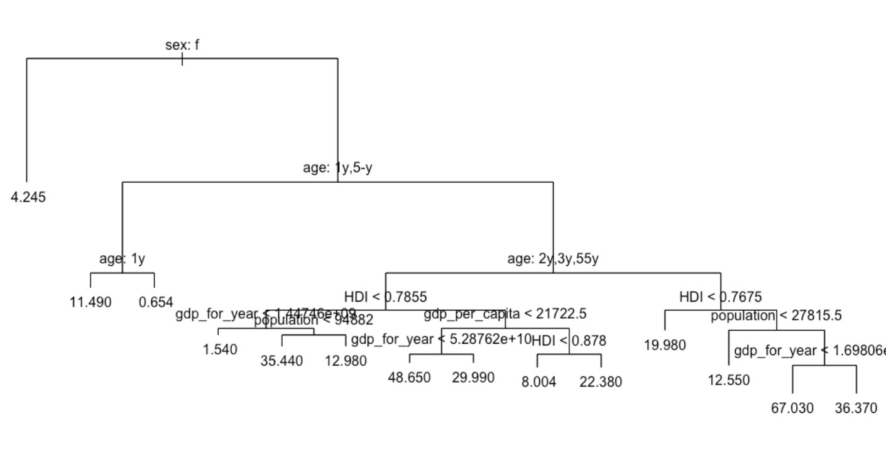
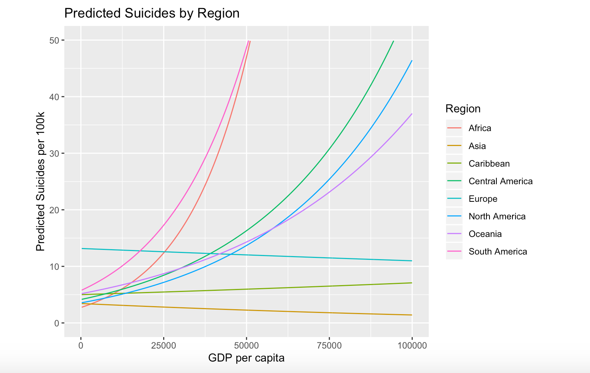
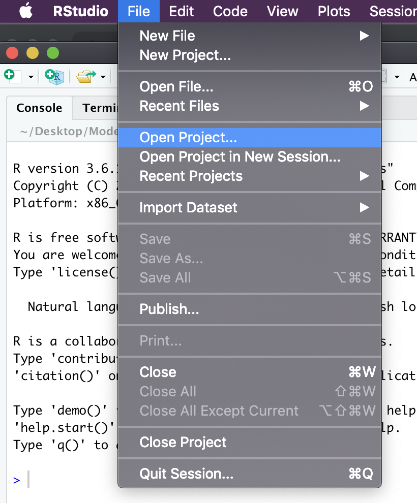
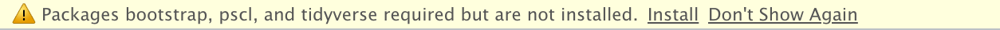

# Modeling Worldwide Suicide Data

This is a project that was created as a final assignment for a Statistical Learning course from November to December 2019. The goal of this project was to create and answer interesting questions with a dataset using techniques learned from the course. This was accomplished by utilizing Random Forest and Logistic Regression models on a dataset of worldwide scuicide from https://www.kaggle.com/russellyates88/suicide-rates-overview-1985-to-2016. The Final.pptx file is a powerpoint presentation that goes over the purpose of the project, how it was accomplished, and its results in more detail.  

My role in this project was to create and answer the first question, How accurately can demographic information like sex, age, and generation be used to predict the number of suicides per 100K population? To answer this I compared the results of a single decesion tree, bagged model, and Random Forest that were built using data from a single year. This was tested using a validation set of countries and found that the Random Forest predicted the most accurately with a Mean Squared Error of 71.5. 

### Getting Started 

To run this project download and unzip the files from this directory and start a new project in Rstudio. 

Then move the the ProjectCode.Rmd and master.csv files into the new project directory and open the .Rmd file. You may need to install neccesary packages. 

Finally, just select knit to run the program and receive the 

### Built With 

* RStudio - IDE
* randomForest - Library for Random Forest model tools

### Authors 

* Kyle Dennison - KyleDennison
* Joshua Ingram 
